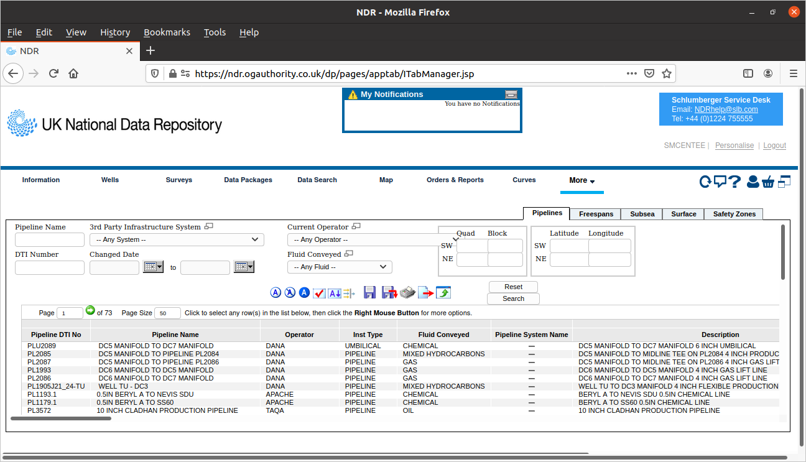
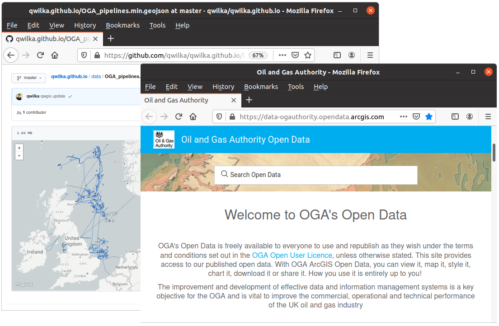

name: about

# About the speaker

.pull-left[

* Subsea / pipelines engineer
* 20+ year’s experience, Aberdeen and Norway
* Startup company Qwilka
  * [Visinum](http://www.qwilka.com/) subsea data management & analytics platform
  * unstructured engineering data, video, images, MBES, lidar, geospatial, etc.
  * http://www.qwilka.com/
]

.pull-right[

<iframe src="https://qwilka.github.io/gis/1/#6/57.071/-0.879/g1-nof-nop-gba-gbp" title="GIS Decomm" width="100%" height="440">
</iframe>
<small>https://qwilka.github.io/gis/decom/</small>

]

Slides:  <a href="https://qwilka.github.io/SUT_joint_seminar_2020/" target="_blank" rel="noopener noreferrer">
https://qwilka.github.io/SUT_joint_seminar_2020/
</a> 

???

### references

* https://qwilka.github.io/SUT_joint_seminar_2020/
* http://www.qwilka.com/

---
name: objectives

# Objectives  

* Review regulations relating to pipeline decommissioning
  * focus on UKCS  

* Look at the  options for pipeline decommisioning

* Discuss the role of data and digital technology

* Propose that preserving pipeline data now will help ensure sustainability post-decommissioning for pipelines left in-situ

???

1. Objectives of this talk  
 

---
# Overview 

* Total estimated cost £48 billion (OGA 2020 [1])

* Cost is ~10% total annual expenditure of UK oil&gas industry [2]

* Industry pays full cost, claims tax relief (est. £16 billion [2])

* Pipelines and subsea infrastructure account for 10% of decommissioning cost [1]  

* ~6000km pipelines to be decommissioned over next 10 years in UKCS  

* options for pipelines: abandon in place; full/partial removal; or re-use
  * most subsea pipelines will be "abandoned" in place after decommissioning

---
# Considerations for Decommissioning

* Costs
  * Cost to owner 
  * Cost to society / taxpayers / other stakeholders 

* Technical feasibility  

* Other uses of the sea and seabed  

* Re-use of assets  

* Environmental issues  
  * wildlife habitats  

* Sustainability   
  * the future could have very different values and judgements 
  * securing data for the future will be critical   
  * enable future stakeholders to make their own decisions   

---

# Legislation and Regulations

* International treaty
  * OSPAR Convention 1998 <a href="https://www.ospar.org/convention/text" target="_blank" rel="noopener noreferrer">link</a>

* UK Legislation
  * UK Petroleum Act 1998 <a href="https://www.legislation.gov.uk/ukpga/1998/17/contents" target="_blank" rel="noopener noreferrer">link</a>
  * Offshore Petroleum Activities (Conservation of Habitats) Regulations 2001/2007 <a href="https://www.legislation.gov.uk/uksi/2001/1754/contents/made" target="_blank" rel="noopener noreferrer">link</a>

* Guidance
  * Decommissioning of offshore installations and pipelines <a href="https://www.gov.uk/guidance/oil-and-gas-decommissioning-of-offshore-installations-and-pipelines" target="_blank" rel="noopener noreferrer">link</a>
  * Oil and gas: offshore environmental legislation <a href="https://www.gov.uk/guidance/oil-and-gas-offshore-environmental-legislation" target="_blank" rel="noopener noreferrer">link</a>  

* There are currently no international guidelines on the decommissioning of disused pipelines    

???

### references
* https://www.ospar.org/convention/text
* 
* 

---

# BEIS Guidance Notes 

<small>(Paraphrased extracts from 2018 BEIS Guidance Notes [4], section numbers noted)</small>

* Robustly assess decommissioning options based on evidence and data (10.2)  
* Must aim to achieve a clear seabed (11.1/ANNEX H)  
* Potential for reuse of the pipeline should be considered before decommissioning (10.5)  
* Small diameter pipelines are expected to be entirely removed (10.18)
* The following pipelines may be candidates for in-situ decommissioning (10.12):  
  * those which are adequately buried and trenched ... expected that burial minimum depth of 0.6m will be necessary  
  * pipelines which are not trenched or buried ... are candidates for leaving in place if the comparative assessment shows that to be the preferred option in particular trunk lines (10.12) 
  * in addition to cleaning pipelines to remove hydrocarbons, reasonable endeavours to remove wax and other contaminants (10.7)
* Mattresses, grout bags, or contained rock deposits should be considered for removal with the aim to achieve a clear seabed (11.1)
  * recognised that removal of rock-dump is unlikely to be practicable and it is generally assumed that the rock-dump and the pipeline will remain in place (10.19)  

???
1. all feasible decommissioning options should be considered (10.5)  
1. removal of the rock-dump is unlikely to be practicable and it is generally assumed that the rock-dump and the pipeline will remain in place
1. Small diameter pipelines, including flexible flowlines and umbilicals are expected to be entirely removed 
1. snagging risk is a major concern

[4] BEIS <a href="https://assets.publishing.service.gov.uk/government/uploads/system/uploads/attachment_data/file/760560/Decom_Guidance_Notes_November_2018.pdf">Guidance Notes Decommissioning of Offshore Oil and Gas Installations and Pipelines</a> November 2018

---

# Survey, Monitoring, Data

<small>(Paraphrased extracts from 2018 BEIS Guidance Notes [4], section numbers noted)</small>

* Upon completion of decommissioning, surveys should be undertaken to identify and recover any debris or obstructions on the seabed (12.38)

* Pipelines and stabilisation features left in place will be subject to a risk based monitoring regime (15.4)  
  * areas where deposits have not been removed will be subject to monitoring requirements post decommissioning (11.6)  

* Pipelines decommissioned in place should be supported by a study which addresses the degree of past and future burial/exposure of the pipeline (10.11)  
  * study should include the survey history of the line with appropriate data    

* Geotechnical data collected under the petroleum licence should be placed in the [National Hydrocarbons Data Archive](http://www.bgs.ac.uk/nhda/) (14.5)  

* Intention is that companies will make provision for keeping the most historically important records in the [Oil and Gas Archive](https://www.capturing-the-energy.org.uk/research/oilgasarchive/) (19.3)

???

1. Pipeline decommissioned in place, then the programme should be supported by a suitable study which
addresses the degree of past and likely future burial/exposure of the pipeline 
and any potential effect on the marine environment and other uses of the sea. 
1. The study should
include the survey history of the line with appropriate data to confirm the current status of
the line including the extent and depth of burial, trenching, spanning and exposure. It
should also detail levels of fishing activity in the area.
1. NHDA National Hydrocarbons Data Archive   British Geological Society
1. Oil and Gas Archive at the University of Aberdeen

---

# Liabilities and Legacies

<small>(Paraphrased extracts from 2018 BEIS Guidance Notes [4], section numbers noted)</small>

* Residual liability remains with the owners in perpetuity (17.2)  

* Persons/parties who own an installation or pipeline at the time of its decommissioning will remain the owners of any residues and remains after decommissioning (17.1)  

* Measures to manage the potential risks arising from any legacies should be addressed in the decommissioning programme (17.6)  

* Remedial activity (including removal of the pipeline) may be required if issues arise (10.21)  

---

# Large Diameter Pipelines

* Pipelines Do>16" are typically "surface laid" (lying exposed on seabed and not trenched) in UKCS

* Technology for removal of large pipelines is not well developed
  * reverse S-lay 
  * cut-in-place and recover sections

* Trenching and burial would be technically difficult and costly

* Rock-dumping all UKCS surface laid pipelines would require minimum 74 million tonnes rock (estimated, Rouse et al. [6])

???

### Large Diameter Pipelines a challenge

---

# Pipeline Re-use

* Re-use for hydrocarbon transport/storage  

* H2 export of offshore generated "green" hydrogen (Ounnas [7])  

* CO2 transport as part of CCS  

* Full documentation and data packages will be required to qualify a pipeline for re-use  

* Historical survey data will be crucial for determining the fatigue damage sustained by the pipeline and the remaining lifetime  

* Even with re-use, still must plan for ultimate decommissioning   

---

# The Role of Data

* The oil & gas industry is sitting on a huge amount of pipeline related data, and is doing little or nothing with it  
  * there is a risk that this data will be lost after decommissioning
  * historically, integrity data has been discarded after risk shown to be ALARP

* «fear of data» still pervades the industry
  * something-could-happen if data  is released
  * unable see the benefits of sharing data, only the risks

* Collating and sharing environmental data has major benefits for decommissioning (Murray et al. [9]) 

* Examples of reservoir and exploration data being openly shared
  * Equinor’s Volve and Northern Lights <a href="https://www.equinor.com/en/how-and-why/digitalisation-in-our-dna.html">data sets</a>  
  * OGA <a href="https://ndr.ogauthority.co.uk/">National Data Repository</a>  

---
class: middle, center, notitletop
background-size: cover

<a href="https://ndr.ogauthority.co.uk/" target="_blank" rel="noopener noreferrer">https://ndr.ogauthority.co.uk/</a>

---
class: middle, center, notitletop
background-size: cover

<small>
<a href="https://data-ogauthority.opendata.arcgis.com/datasets/oga-offshore-zipped-shapefiles-wgs84" target="_blank" rel="noopener noreferrer">https://data-ogauthority.opendata.arcgis.com/datasets/oga-offshore-zipped-shapefiles-wgs84</a>
</small>

---

# Role of Data Post-decommissioning

* Post-decommissioning, data still has major role
  * data enables risk-based monitoring and removal decision making
  * future stakeholders will want to make their own decisions

* Data-informed risk evaluation  
  * data from surveys, field observations and monitoring can help build a realistic understanding of how infrastructure actually behaves 
  * more data means outcome probabilities can be more accurately assessed  
  * more confidence in risk evaluation means reduced costs and safer outcomes  

* Maintaining full historical datasets enables better analyses
  * integrity process has been based on demonstrating ALARP, historically
  * at end of integrity cycle, data has been discarded
  * degradation processes are progressive
  * accurately representings corrosion, fatigue, freespan development processes requires full historical datasets

---

# Benefits from Sharing Data

* Commercial opportunities  
  * «Industry 4.0» is being built on data-based digitial technologies
  * access to real-world, quality data is essential for developing data-based businessess 

* Digitial twin technologies  
  * realistic 3-D visualisations combined with physical modelling  
  * models used in digital twins are currently mostly based on engineering theory  
  * risk of a gap between realistic visual representations and theory-based modelling  
  * need data-driven models that combine engineering theory with real-world data  

* Probabilitic risk-based analysis
  * enables optimal decision making  
  * more data means better outcomes    

???

1. Digitial twin technologies are becoming increasingly sophisticated and common
  1. realistic 3-D visualisations combined with physical modelling
  1. provide a physically realistic and intutive indiction of the current state of a system
  1. potential for predicting future system states 
1. Currently most of the models used in digital twins are based on engineering theory

---

# Conclusions

* Pipeline decommissioning is still a developing field

* Abandonment in-place is currently the preferred option for most subsea pipelines

* The decommissioning process in the UKCS is well developed and robust 

* Pipeline related data should be secured for the future as part of the decommissioning process

* Opening data to wider use has commercial and technical benefits

* Securing full datasets for the future will help ensure sustainable decommissioning  

---
# References

1. Oil & Gas Authority <a href="https://www.ogauthority.co.uk/news-publications/publications/2020/ukcs-decommissioning-cost-estimate-2020/" target="_blank" rel="noopener noreferrer">UKCS Decommissioning Cost Estimate 2020</a>
1. OGUK <a href="https://oilandgasuk.co.uk/product/decommissioning-insight-report/" target="_blank" rel="noopener noreferrer">Decommissioning Insight 2019</a>
1. GOV.UK webpage <a href="https://www.gov.uk/guidance/oil-and-gas-decommissioning-of-offshore-installations-and-pipelines" target="_blank" rel="noopener noreferrer">Guidance decommissioning of offshore installations and pipelines</a>
1. BEIS <a href="https://assets.publishing.service.gov.uk/government/uploads/system/uploads/attachment_data/file/760560/Decom_Guidance_Notes_November_2018.pdf">Guidance Notes Decommissioning of Offshore Oil and Gas Installations and Pipelines</a> November 2018
1. Manouchehri, Subsea Pipelines and Flowlines Decommissioning - What We Should Know for a Rational Approach, OMAE2017-61239
1. Rouse et al., Offshore pipeline decommissioning: Scale and context, Marine Pollution Bulletin 129 (2018) 241–244
1. Ounnas, Hydrogen storage and transportation, is this feasible for our current pipeline network, <a href="https://www.subseauk.com/documents/documents2019/8%20-%20soffiane%20ounnas%20-%20xodus%20group.pdf" target="_blank" rel="noopener noreferrer">presentation Subsea Expo, Aberdeen, 2020</a>
1. OGUK <a href="https://oilandgasuk.co.uk/product/guidelines-decommissioning-of-pipelines-in-the-north-sea-region/" target="_blank" rel="noopener noreferrer">Decommissioning of pipelines in the North Sea region, 2013</a>
1. Murray et al., Data challenges and opportunities for environmental management of North Sea oil and gas decommissioning in an era of blue growth, Marine Policy v.97 (2018) p. 130-138 
1. McEntee 2019 <a href="http://www.qwilka.com/talk/2019-10-31_sut_future_digital_toolbox/" target="_blank" rel="noopener noreferrer">presentation Beyond visualisations: realising the full value of subsea data</a>   

---
class: middle, center, notitletop
background-image: url(assets/qwilkagis_sea.jpg)
background-size: cover

.large[**https://qwilka.github.io/SUT_joint_seminar_2020/**]

