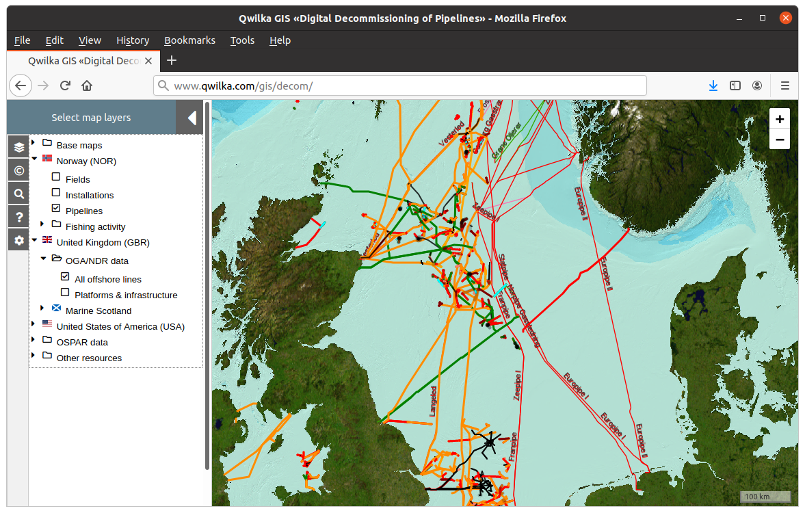

name: about

# About the speaker

.pull-left[

* Subsea / pipelines engineer
* 20+ year’s experience, Aberdeen and Norway
* Pipelines/risers design, offshore project engineer, pipelines design coordinator
* Startup company Qwilka
  * Visinum data management & analytics platform
  * Unstructured engineering data
  * Manage, extract value from video, images, MBES, lidar etc.
]

.pull-right[
 
]

<a href="http://www.qwilka.com/ "target="_blank" rel="noopener noreferrer">
http://www.qwilka.com/
</a> 

???

### references

* https://qwilka.github.io/SUT_joint_seminar_2020/
* http://www.qwilka.com/

---
name: objectives

# Objectives of this talk

* Review regulations and expectations relating to pipeline decommissioning
  * focus on UKCS
* Look at options and reasons for choosing options
* Discuss the role of data and digital technology
* Propose that preserving pipeline data now will help ensure sustainability post-decommissioning for pipelines left in-situ

 

---

# Overview of decommissioning

* Total cost of decommissioning £48 billion (OGA 2020 est. [1])

--
* Decommissioning cost is ~10% total annual expenditure of UK oil & gas industry [2]

--
* Industry pays full cost, claims tax relief (est. £16 billion [2])

--
* Pipelines and subsea infrastructure account for 10% of decommissioning cost [1]

--
* ~6000km pipelines to be decommissioned over next 10 years in UKCS

--
* options for pipelines: abandon in place; full/partial removal; or re-use

--
  * most subsea pipelines will be “abandoned” in place after decommissioning

???

[1] OGA <a href="https://www.ogauthority.co.uk/news-publications/publications/2020/ukcs-decommissioning-cost-estimate-2020/" target="_blank" rel="noopener noreferrer">UKCS Decommissioning Cost Estimate 2020</a>  
[2] OGUK <a href="https://oilandgasuk.co.uk/product/decommissioning-insight-report/" target="_blank" rel="noopener noreferrer">Decommissioning Insight 2019</a>

---

# Considerations for strategy

* Cost  

--
* Cost to taxpayers  

--
* Technical feasibility  

--
* Environmental issues  
  * wildlife habitats  

--
* Sustainability issues  

--
* Other uses of the sea and seabed  

--
* Re-use of assets  

---

# Legislation and Regulations

* International treaty
  * OSPAR Convention 1998 <a href="https://www.ospar.org/convention/text" target="_blank" rel="noopener noreferrer">link</a>

--
* UK Legislation
  * UK Petroleum Act 1998 <a href="https://www.legislation.gov.uk/ukpga/1998/17/contents" target="_blank" rel="noopener noreferrer">link</a>
  * Offshore Petroleum Activities (Conservation of Habitats) Regulations 2001/2007 <a href="https://www.legislation.gov.uk/uksi/2001/1754/contents/made" target="_blank" rel="noopener noreferrer">link</a>

--
* Guidance
  * Decommissioning of offshore installations and pipelines <a href="https://www.gov.uk/guidance/oil-and-gas-decommissioning-of-offshore-installations-and-pipelines" target="_blank" rel="noopener noreferrer">link</a>
  * Oil and gas: offshore environmental legislation <a href="https://www.gov.uk/guidance/oil-and-gas-offshore-environmental-legislation" target="_blank" rel="noopener noreferrer">link</a>  

--
  * There are currently no international guidelines on the decommissioning of disused pipelines    

???

### references
* https://www.ospar.org/convention/text
* 
* 

---

# BEIS guidance notes - general approach

(paraphrased extracts from BEIS guidance notes [3])

* robustly assess decommissioning options based on evidence and data (10.2)  
  * all feasible decommissioning options should be considered (10.5)  

---
* must aim to achieve a clear seabed (11.1/ANNEX H)  

--
* the potential for reuse of the pipeline should be considered before decommissioning (10.5)  

---
# References

1. Oil & Gas Authority <a href="https://www.ogauthority.co.uk/news-publications/publications/2020/ukcs-decommissioning-cost-estimate-2020/" target="_blank" rel="noopener noreferrer">UKCS Decommissioning Cost Estimate 2020</a>
1. OGUK <a href="https://oilandgasuk.co.uk/product/decommissioning-insight-report/" target="_blank" rel="noopener noreferrer">Decommissioning Insight 2019</a>
1. GOV.UK <a href="https://www.gov.uk/guidance/oil-and-gas-decommissioning-of-offshore-installations-and-pipelines" target="_blank" rel="noopener noreferrer">Guidance decommissioning of offshore installations and pipelines</a>
1. Manouchehri, Subsea Pipelines and Flowlines Decommissioning - What We Should Know for a Rational Approach, OMAE2017-61239
1. Rouse et al., Offshore pipeline decommissioning: Scale and context, Marine Pollution Bulletin 129 (2018) 241–244
1. Ounnas, Hydrogen storage and transportation, is this feasible for our current pipeline network, <a href="https://www.subseauk.com/documents/documents2019/8%20-%20soffiane%20ounnas%20-%20xodus%20group.pdf" target="_blank" rel="noopener noreferrer">presentation Subsea Expo, Aberdeen, 2020</a>
1. OGUK <a href="https://oilandgasuk.co.uk/product/guidelines-decommissioning-of-pipelines-in-the-north-sea-region/" target="_blank" rel="noopener noreferrer">Decommissioning of pipelines in the North Sea region, 2013</a>
1. Murray et al., Data challenges and opportunities for environmental management of North Sea oil and gas decommissioning in an era of blue growth, Marine Policy v.97 (2018) p. 130-138 
1. McEntee 2019 <a href="http://www.qwilka.com/talk/2019-10-31_sut_future_digital_toolbox/" target="_blank" rel="noopener noreferrer">presentation Beyond visualisations: realising the full value of subsea data</a>   

---
class: middle, center, notitletop
background-image: url(assets/qwilkagis_sea.jpg)
background-size: cover

.large[**https://qwilka.github.io/SUT_joint_seminar_2020/**]

